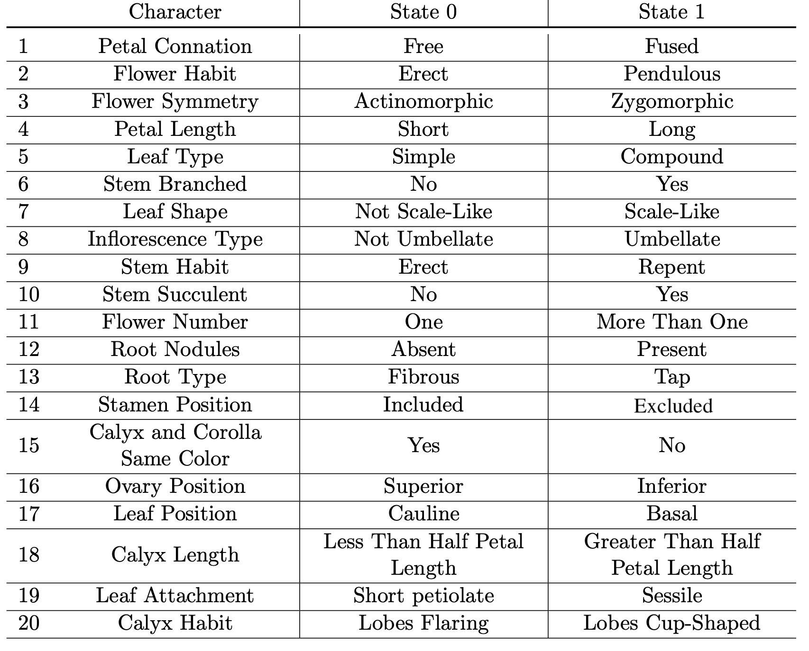
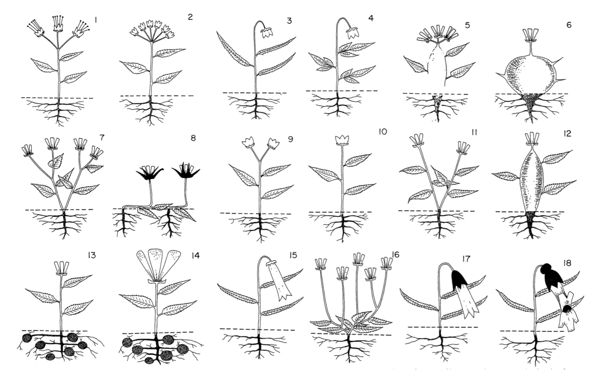
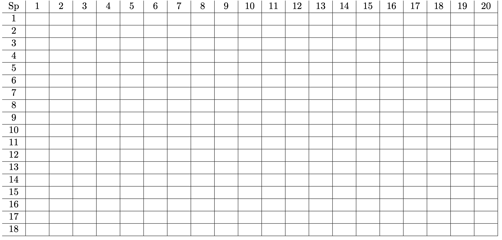

# Basic Methods in Structural and Evolutionary Botany

## Phylogenetics In-Class Exercises and Protocol Assignment

### Norman Wickett
### 6 March, 2026

These exercises and explanations were developed with, and heavily
influenced by a previous postdoc who worked in my group in Chicago,
<a href="https://www.mossmatters.com/" target="_blank">Matt Johnson</a>,
so many thanks to him! Over time this document has been updated and
modified to fit different courses and objectives. It is always a work in
progress but will hopefully help you learn some of the basics of
phylogenetics.

For today’s exercise, you will learn more about the *process* of
building a phylogeny and *interpreting* trees. The exercises below are
connected to a few short(ish) lectures that will be provided in today’s
class; the lecture slides are available on Moodle. Lectures will touch
on three topics: (1) The basics of phylogenetics and parsimony, (2) DNA
sequencing and molecular phylogenetics, and (3) Ancestral character
state reconstruction.

At the end of this document, you will find a description of what should
be done for the phylogenetics section of the protocol, which will
consist of analyses of DNA sequence data and character states for
Primulaceae, so that it is connected to the work you have done in the
first half of this course. If you are assigned Phylogenetics for either
your presentation or your section of the protocol, and you have
questions or would like some help, please feel free to contact me
(<a href="mailto:norman.wickett@univie.ac.at">norman.wickett@univie.ac.at</a>)
and make an appointment to see me in my office.

In this tutorial, files that you may need to create, or commands that
you may have to enter or select for running online phylogenetics tools
will be represented by text like this:

    Here's an example of text representing options you may select for an analysis.

# Objectives

By the end of today’s class you should:

-   Understand the importance of homology in phylogenetics
-   Build a character matrix using morphological characters
-   Become familiar with the file formats used for molecular
    phylogenetics
-   Perform the steps necessary to generate a phylogeny from DNA
    sequence data
-   Understand how to visualize and interpret phylogenies
-   Understand how to reconstruct and interpret ancestral character
    states

This is a lot of information! Don’t get discouraged - I’m here to help,
and remember that the overall goal is to demystify phylogenetics a
little bit, not to become an expert. I’ll be co-teaching
<a href="https://ufind.univie.ac.at/en/course.html?lv=300029&semester=2026S" target="_blank">
molecular phylogenetics and phylogenomics</a> later this semester and
that course will go into much more detail.

# Phylogenetics Fundamentals

By this point you should have already heard a short lecture on the
fundamentals of phylogenetics, particularly about the concepts of
homology, building a matrix of homologous characters, and using the
matrix to find the “best” tree using the parsimony optimality criterion.
The following exercise is a bit silly, but it is meant t o reinforce
these concepts.

## The Character Matrix and Parsimony

We are going to start learning how to reconstruct species relationships
using a relatively simple example that involves a set of fake plant
species in the fake plant family Dendrogrammaceae. The objective of this exercise is to reinforce the concept of homology and it's importance in phylogenetics, and to get a first view into how a character matrix is "translated" into a phylogenetic hypothesis.

Developed by Duncan et al. in 1980, the Dendrogrammaceae is a family of
hypothetical plant species. They were designed as a test case to compare
and evaluate methods for reconstructing phylogenetic trees from
morphological data. There is no underlying “true” phylogeny, but the
organisms were drawn with the idea that while they shared a common
ancestor, the relationships among the species is unknown. See Figure 1
for the drawings of the eighteen species.

The authors use 20 binary characters to describe the eighteen species of
the Dendro- grammaceae. These characters are typical botanical features
assumed to be homologous in the family. Each character has only two
states, and results in a binary character matrix. See Table 2.1 for the
full list of characters and states.

To code these characters with the states as you interpret them, you must
first be familiar with some of the vocabulary of plant anatomy. The
following definitions should help you decide how to code the characters
listed in Table 2.1.

1.  Petal Connation: Fused petals form a tube in which adjacent petals
    are “joined” together, whereas free petals are not attached to
    adjacent petals.
2.  Flower Habit: Does the flower point straight up (erect) or does it
    curve over towards the ground, like the handle of an umbrella
    (pendulous)?
3.  Flower Symmetry: Does the flower have multiple planes of symmetry
    (radial, actinomorphic) or can you divide into two equal halves
    along only one plane (zygomorphic)?
4.  Petal Length: Short or long (no explanation needed!).
5.  Leaf Type: A compound leaf is a leaf made up of smaller leaves (like
    a walnut tree or a fern).
6.  Stem Branched: Is there a single stem with leaves or are there
    multiple stems (branches) with leaves?
7.  Leaf Shape: Scale-like leaves are short, reduced leaves that form
    something that looks like a reptile or fish scale.
8.  Inflorescence Type: Umbellate is like the underside of an umbrella,
    where there are multiple “sticks” radiating out from a central
    point.
9.  Stem Habit: A repent stem “creeps” along the ground before bending
    upwards.
10. Stem Succulent: A succulent stem is thick and full of water, like a
    cactus stem.
11. Flower Number: One or many - no explanation needed here!
12. Root Nodules: These are small “balls” along the roots that house
    nitrogen-fixing bacteria.
13. Root Type: A fibrous root doesn’t have one main root but is a
    diffuse system of similar-size roots. A tap root has a main root
    with smaller side branches.
14. Stamen Position: Included means the stamens don’t extend outside of
    the petals, whereas excluded means they do.
15. Calyx and Corolla Same Color: Calyx is the collective term for
    sepals and corolla is the collective term for petals.
16. Ovary Position: If the ovary (site of the ovules and matures into
    the fruit) is below the calyx and corolla, it is inferior.
17. Leaf Position: Cauline leaves are attached along the stem and basal
    leafs all emerge from the base of the stem near the ground.
18. Calyx Length: No explanation needed.
19. Leaf Attachment: A short petiolate leaf has a little “stalk” that
    attaches the leaf to the stem, whereas a sessile leaf has a leaf
    base that is directly attached to the stem.
20. Calyx Habit: A flaring calyx is when the sepals curve away from the
    flower, versus a cup-shaped calyx.

 

<strong>Table 1: Character States of Dendrogrammaceae</strong>

 

  

<strong>Figure 1: Species of Dendrogrammaceae</strong>

 

## Filling in the Matrix

It would take up too much of the class time for everyone to fill in the
entire matrix on their own, so you should first find a partner to work
with. Once you have a partner (or group of three if there is an odd
number of students), you will be assigned a subset of the twenty
characters.

-   Divide into groups of two (or three). Each group will be assigned
    five characters to code in the character matrix. The characters are
    listed in Table 1, with explanations above.

-   For each character in your assigned set of characters, assign a
    state (1 or 0) for each of the 18 species and enter it in Table 2.
    As you learned during the lecture, you will also need an *outgroup*
    so that you can infer a root for your tree. To do this, create an
    extra species (we can call it species 0) that has state 0 for every
    character.

-   Enter your data into the Google Sheet located here:
    <https://tinyurl.com/39bjyyzt>

 

<strong>Table 2: Blank Dendrogrammaceae Character Matrix</strong>

 

 

## Reconstruct the Phylogeny of Dendrogrammaceae

Because of the Too Many Trees Problem, reconstructing phylogenies
requires a computer program to search for likely trees. The programs
must read your character matrix from a file and output phylogenetic
trees. Unfortunately, there is no universal file type for data character
matrix, and many programs use different input file types. This can be
frustrating if you plan on using multiple programs on the same dataset,
but luckily there are several utilities to convert among file types.

In this section you will reconstruct a phylogenetic tree of the
morphological matrix using the parsimony criterion. Because of the
limitations of the program you will be using today, the result of the
analysis will be a single most parsimonious tree, but normally it would
set of phylogenetic trees that are tied for the “best” score from which
a consensus tree could be made.

### T-Rex

We can use an online tool to infer a species tree from our data matrix
using Parsimony as our optimality criterion. The tool we are using is
the T-Rex web server. It has a cool name and it’s Canadian, but that’s
not why we are using it. It’s not perfect, but it will do the job for us
for now. You can access the T-Rex web server here:

<a href="https://www.trex.uqam.ca/index.php?action=phylip&app=pars" target="_blank">https://www.trex.uqam.ca/index.php?action=phylip&app=pars</a>

### Create an Input File for T-Rex

In general it is a good idea to avoid using fancy word processors, like
Microsoft Word, to prepare your data matrix. Instead, use plain text
editors such as Notepad (Windows) or Text Wrangler (Mac).

The data matrix input format in PHYLIP is very strict, and has the
following required features:

-   On the first line, two numerals separated by a space. The first
    numeral is the number taxa (18 for this matrix), followed by the
    number of characters (20).

-   All other lines contain a taxon identifier and the data for that
    taxon.

-   The taxon name must be exactly ten characters long. **Note that
    space characters count!**

A Phylip file with 19 taxa and 20 characters, where the taxon
identifiers are digits, would therefore look like this:

     19 20
    0         00000000000000000000
    1         10000001001001000000
    2         10000001001000000000
    3         11000000100000000000
    4         11001000100000000000
    5         00000001011010000100
    6         00000010010010000110
    7         00000100001000000100
    8         00000100001000101110
    9         00000000001000000000
    10        00000000000000000001
    11        00000100001000000110
    12        00000000010010000110
    13        00000000000100000100
    14        00010000000100000100
    15        01010000100000010110
    16        00000100001000001110
    17        01010000100000110110
    18        11110000100000110111

Working in your group of two or three, one of you should use your plain
text editor to create a Phylip file based on the data that was entered
in the Google Sheet. **Note that an outgroup taxon has been added, taxon
0, and all of the states for this taxon were set to 0.** This will come
in handy when we want to root our tree later. Note, too, that the
example Phylip file above is coded as DNA data. For you Phylip file, you
can enter the states as 0 and 1, just as they are in the Google Sheet.

### Parsimony Reconstruction

Now that you have a Phylip file, you are ready to build a tree. Follow
these steps:

1.  Navigate to
    <https://www.trex.uqam.ca/index.php?action=phylip&app=pars> in a
    browser.

2.  Copy the contents of your Phylip file and paste it into the box.

3.  Keep all settings as default with one exception: Change
    `Number of trees to save` to 1. While this isn’t always a good idea
    when using Parsimony on a small dataset, we’re doing this just to
    make it easier to view the output.

4.  Click the `Compute` button.

Almost immediately after hitting `Compute`, you will see a page that
lists the Output files. While you could view the tree here, it doesn’t
do a great job. Instead, click on `Outtree`. A new window will pop up
with a string of text. This is your tree written as a Newick file.
Newick files represent relationships by nesting sets of species within
other sets using parentheses.

### Viewing Your Tree

Open up a new browser window or tab and navigate to:
<https://itol.embl.de/>. Click on `Upload a tree`. Copy and paste the
Newick file contents from T-Rex into the tree text box. Your tree will
show up on the screen, but it will look a little weird. In the
`Branch lengths` settings, click `Ignore` and your tree will look a lot
more “normal.” Now we want to root the tree:

1.  Hover your cursor over the branch leading to species 0 and click.

2.  A window will pop up, and under `Editing` there is an option for
    `Tree structure`.

3.  Click on `Tree structure` and choose `Re-root the tree here`. Now
    your tree is rooted!

Take a look at your tree and compare it with the drawings of the
Dendrogrammaceae species. Does your tree make sense? Do closely related
species look more alike that they do with distantly related species?

# Molecular Phylogenetics

Now it’s time to build some trees using DNA sequence data and Maximum
Likelihood as our optimality criterion.

## Objectives

-   Become familiar with molecular data in the FASTA format.

-   Conduct a multiple sequence alignment and phylogeny reconstruction.

-   Assess statistical support for clades on a phylogenetic tree using
    bootstrapping.

## The Dataset

You will be using a dataset of 21 species and four genes to reconstruct
the early branching events of angiosperms. Historically there has been a
lot of debate about the branching order of five major groups: (1) the
ANA grade comprising Amborellales, Nymphaeales, and Austrobaileyales,
(2) Ceratophyllales, (3) Magnoliids (made up of 4-5 orders depending on
who you ask), (4) Monocots, and (5) Eudicots. The taxa that we will be
using to reconstruct the relationships of these groups are:

-   *Thuja plicata* (Gymnosperm; Outgroup)
-   *Amborella trichopoda* (ANA grade; Amborellales)
-   *Victoria amazonica* (ANA grade; Nymphaeles)
-   *Nuphar lutea* (ANA grade; Nymphaeles)
-   *Trimenia moorei* (ANA grade; Austrobaileyales)
-   *Illicium parviflorum* (ANA grade; Austrobaileyales)
-   *Ceratophyllum demersum* (Ceratophyllales)
-   *Chloranthus spicatus* (Magnoliid; Chloranthales)
-   *Piper nigrum* (Magnoliid; Piperales)
-   *Drimys winteri* (Magnoliid; Canellales)
-   *Cinnamomum camphora* (Magnoliid; Laurales)
-   *Magnolia grandiflora* (Magnoliid; Magnoliales)
-   *Liriodendron tulipifera* (Magnoliid; Magnoliales)
-   *Acorus calamus* (Monocot; Acorales)
-   *Vanilla planifolia* (Monocot; Asparagales)
-   *Calochortus uniflorus* (Monocot; Liliales)
-   *Typha latifolia* (Monocot; Poales)
-   *Oryza sativa* (Monocot; Poales)
-   *Aquilegia coerulea* (Dicot; Ranunculales)
-   *Salvia rosmarinus* (Dicot; Lamiales)
-   *Cucumis sativus* (Dicot; Cucurbitales)

You will be using four separate genes reconstruct at least four
phylogenies. The gene files are available on Moodle and are:

1.  rbcL – A chloroplast-encoded gene that encodes the large subunit of
    Rubisco.

2.  ITS – A nuclear locus made up (at least partially) of the ribosomal
    RNA genes and the spacer regions separating them.

3.  5168 – One of the Angiosperms353 loci, a set of loci that can be
    recovered from any angiosperm using target capture.

4.  5921 – Another Angiosperms353 locus.

If you want to know more about the Angiosperms353 loci, you can check
out the paper that describes them:
<https://doi-org.uaccess.univie.ac.at/10.1093/sysbio/syy086>

These are the same genes that were used in the recent, large-scale
phylogeny of angiosperms by Zuntini et al. in Nature:
<https://doi.org/10.1038/s41586-024-07324-0>

**Go ahead and download the files now.**

Open up one of the files in your plain text editor. These files are in
the FASTA format, which is a standard format for DNA or protein sequence
files. The format is very simple. The first line of the file contains
the identifier for the first sequence. This line always starts with a
&gt; sign. The sequence then begins on the next line, and can wrap
around multiple lines until the line begins with another &gt;. This
indicates the sequence has finished and the next sequence begins. FASTA
files should look something like this:

    >Thuja_plicata
    CAAACAGAAACTAAAGCAAGTGTCGGATTCAAAGCGGGTGTTAAAGATTACAGATTAACTTATTATACTC
    CGGAGTATCAGACCAAAGATACTGATATCTTGGCAGCATTCCGAGTCACTCCTCAACCTGGAGTGCCCCC
    CGAAGAAGCGGGANNNGCAGTAGCTGCCGAATCTTCCACTGGTACGTGGACCACTGTTTGGACCGATGGA
    CTTACCAGTCTTGATCGCTACAAGGGGCGATGCTATGATATTGAACCCGTTCCTGGAGAGGAAAATC
    >Amborella_trichopoda
    GCGCTGGATTCAAAGCCGGTGTTAAAGATTACAGATTGACTTATTATACTCCTGACTATGAAACCCTAGC
    TACTGATATCTTGGCAGCATTCCGAGTAACTCCTCAACCTGGAGTTCCACCTGAGGAAGCAGGAGCTGCA
    GTAGCTGCCGAATCTTCCACTGGTACATGGACAACTGTGTGGACCGATGGACTTACCAGCCTTGATCGTT
    ACAAAGGTCGATGCTACCACATCGAACCCGTTGCTGGGGAACAAAATCAATATATTGCTTATGTAGCTTA
    TCCTTTGGACCTTTTTGAGGAAGGTTCTGTTACTAACATGTTTACTTCCATCGTA
    >Victoria_amazonica
    ATTACACTCCTGATTATGAAACCCTTGCTACTGATATCTTGGCAGCATTCCGAGTAACTCCTCAACCTGG
    AGTTCCGCCTGAGGAAGCAGGAGCTGCGGTGGCTGCCGAATCTTCCACTGGTACATGGACAACTGTGTGG
    ACCGATGGACTTACCAGCCTTGATCGTTACAAAGGACGATGCTACCACATCGAGCCTGTTGCTGGGGAGG
    AAAATCAATATA

## Aligning the Matrix

Remember that Maximum likelihood phylogeny reconstruction considers the
support for a proposed tree at each column of the matrix. Therefore,
alignment of characters is crucial, to ensure the homology of the DNA
characters.

Alignment can be done by eye for a dataset this small, but that can take
hours of fine-tuning. One decision to make is where to insert gaps in
the alignment, which result from insertion or deletion mutations.

We are going to use MAFFT to align our sequences, as it has been shown
to be highly accurate. Luckily, there is an online MAFFT server that you
can access here:

<https://mafft.cbrc.jp/alignment/server/index.html>

Once you have navigated to the MAFFT site, use the `Choose file` button
to upload one of your FASTA files. I would suggest trying rbcL first, as
it’s a very “clean” dataset. You are certainly welcom to play around
with the MAFFT parameters, but for our needs, using the default settings
is just fine.

**Scroll down and click one of the** `Submit` **buttons.**

After a few seconds you will see your alignmnent in the `CLUSTAL`
format. If you click on the `Fasta format` link at the top of the page,
it will automatically download the alignment as a FASTA file. Go ahead
and do this now.

Next, click the `View` menu item at the top of the page. You can use any
view you would like, but my recommendation is to click
`Start MSAViewer in this window`. This will open up the alignment and
you can scroll to the right to see how the sequences have been aligned
along the length of the gene.

**Align each of the four FASTA files separately.** You might want to do
each alignment in a separate browser tab so you can toggle between them.
Observe the alignments:

-   Which alignment looks like it has the highest number of homologous
    sites along the length of the gene?

-   Which alignments look “messy” – “ragged ends,” lots of gaps
    (insertions and deletions)?

-   Do you notice a difference between the non protein-coding locus
    (ITS) and the other three protein-coding genes?

-   Do you notice a difference between the chloroplast gene (rbcL) and
    the other three (nuclear) genes?

-   Is the outgroup sequence obvious (does it appear much more divergent
    than the others)?

## Reconstructing Phylogenies using Maximum Likelihood

You should now have four alignment files in FASTA format. These are your
character matrices for phylogeny reconstruction.

Today we are going to use `IQ-TREE` to reconstruct our phylogenies.
IQ-TREE is a fast and accurate program that will reconstruct
phylogenetic trees under Maximum Likelihood, allowing you to specify
specific models of DNA sequence evolution or have it pick the best one
based on your data. One of the authors of IQ-TREE is a professor at the
University of Vienna, which may make it less surprising that we can
access the IQ-TREE web server at this address:

<http://iqtree.cibiv.univie.ac.at/>

In the `Input Data` box near the top of the page, browse and upload one
of your aligned FASTA files (again, I suggest doing rbcL first). You can
leave everything else as default, but if you want to be safe you can
change the `Sequence type` selection from `Auto-detect` to `DNA`.

Next, you will want to explore the `Substitution Model Options` box. Go
ahead and leave it as `Auto` for now, but after you have run this
analysis, run two additional analyses: Under the DNA heading in the
dropdown menu, choose JC for one analysis and GTR for another. JC is the
Jukes-Cantor model and is considered to be the “simplest” model, in
which the rate of all substitutions is equal. GTR on the other hand is
one of the most complicated models, with a separate rate for all
substitutions, including different rates, for example, for A -&gt; T and
T -&gt; A. Click both boxes for `Rate heterogeneity` as well; these
options just allow for different sites in your alignment to have
different rates.

Now for the `Branch Support Analysis`. Leave the default `Ultrafast`
button checked. In fact, you can use all the default settings here.

There is no need to change anything else, but you may want to enter your
email address at the bottom to be notified when the analysis is done and
get a link to the results. ***You must use your UniVie email address or
it will not work!***

**Run a total of 12 analyses:**

1.  rbcL with Auto model detection
2.  rbcL with JC
3.  rbcL with GTR
4.  ITS with Auto model detection
5.  ITS with JC
6.  ITS with GTR
7.  5168 with Autho model detection
8.  5168 with JC
9.  5168 with GTR
10. 5921 with Auto model detection
11. 5921 with JC
12. 5921 with GTR

For all analyses, be sure to include a bootstrap analysis.

When an analysis is finished, click the link in the email and you’ll see
a representation of the tree. But we can’t do much with this tree, so we
will want to download the results. You can do this by clicking
`DOWNLOAD SELECTED JOBS` in the lower left corner of the browser window.
This will download a zip file that will unzip into a folder that is
named as your email address. Inside that folder there is another folder
that just has a number for its name. Inside that folder is your IQ-TREE
output. The tree file (in Newick format) that you really want to look at
is the one that ends with `treefile`. So my rbcL tree file would be
named something like this:

    rbcL.ALN.fa.treefile

Go ahead and open that tree file up in the iTOL online tree viewer we
used earlier. Root your tree with *Thuja plicata* (Western Red Cedar and
one of my favourite trees) but don’t ignore the branch lengths this
time. Use the `Advanced` settings to view the boostrap values by
choosing to `Display` the Bootstraps / metadata and choosing to disply
them as `text`. Observe your trees.

-   How are the major groups of angiosperms related to one another?

-   A tree based on all of the Angiosperms353 loci, similar to the
    Zuntini et al. paper, can be viewed here:
    <https://treeoflife.kew.org/tree-of-life/order>. Do you see a
    similar branching order?

-   Compare the three trees *within* each gene (i.e., compare the Auto,
    JC, and GTR trees). Do you see the same relationships? Are the
    branch lengths largely the same?

-   Compare the trees *between* the genes. Are the relationships totally
    different? Do you see some relationships in all of the trees? Which
    relationships are “stable” and which ones are “unstable”?

-   In some trees, do you see a species on a very long branch? If so,
    can you go back to the alignment and observe whether there are a lot
    of gaps or poorly aligned regions?

-   If you observe a lot of conflict between the different datasets, how
    might you address this?

***IMPORTANT:*** You can download your trees as images from the iTOL
viewer. In the Control panel, choose `Export` and you will be presented
with several options for downloading your tree.

# Ancestral Character State Reconstruction

Ancestral character state reconstruction is a way of inferring how
traits have changed over time. The traits in question may be discrete
(e.g., flower color, flower shape) or continuous (e.g., nectar tube
length, leaf width). Using a phylogenetic hypothesis such as the ones
you generated above, you can use the distribution of character states of
extant taxa (or extinct as well, if you have fossils) to identify
synapomorphies (characters shared by a common ancestor and all
descendants), identify convergent evolution (a derived character or
character state shared by two or more unrelated species), or even
macroevolutionary patters (e.g., the association of pollinators with
floral shape). While many methods of ancestral character state
reconstruction are implemented in R, we are going to use a program
called Mesquite today, just to keep things simple (not everyone may be
comfortable using R yet).

## Installing and Running Mesquite

You can download Mesquite by going to mesquiteproject.org and following
the instructions for your operating system. You will likely be prompted
to install Java if it is not already installed. It appears that there
may be some difficulties installing Mesquite on Windows 11. If you are
running windows, makes sure Java is running and then try all of the
Mesquite\_Starter.exe files (e.g., Mesquite\_Starter\_E1.exe). **If you
aren’t able to get Mesquite running, please partner up with someone and
work on this exercise together!**

Click on one of the Mesquite\_Starter.exe files
(Mesquite\_Starter\_E1.exe worked for me) and Mesquite will open.

Download the ACSR\_2025.nex file from Moodle. For the protocol, this
file will be updated as ACSR\_2026.nex once your work from the first
half of the course has been completed. In Mesquite, click File -&gt;
Open File… and choose ACSR\_2025.nex (from wherever you saved the file).

## Reconstructing Ancestral Character States

Once you have opend the ACSR\_2025.nex file, you will be able to view
the character matrix. To open the stored tree, go to the Taxa&Trees menu
and choose New Tree Window -&gt; With Trees from Source. By default,
Stored Trees will be highlighted and simply click OK.

Once the tree is open, check to make sure it is rooted with Pentaphylax.
Then, change the appearance of the tree by choosing Display -&gt; Tree
Form -&gt; Class & Sticks.

To reconstruct the ancestral character states, choose Analysis:Tree
-&gt; Trace Character History. A window will pop up with Parsimony
Ancestral States highlighted; click OK.

# Protocol and Presentation Tasks

If you have been assigned the DNA Sequencing and Phylogenetics topic for
the protocol or presentation, this section describes what you should do
and what to include. All of these analyses will be on data related to
Primulaceae so that it follows the work you did in the Structural Botany
section of this course. Detailed instructions aren’t provided here
because you should simply follow the steps from the examples above - so
just scroll up for details about running andy of the analyses below!
Don’t forget that you can contact me any time at
(<a href="mailto:norman.wickett@univie.ac.at">norman.wickett@univie.ac.at</a>).
I am happy to set up a time to meet in my office to help you if you are
having any problems with these tasks!

## Generate a Phylogeny for Primulaceae

Three datasets are provided for you on Moodle:

-   Primulaceae sequences (ITS)
-   Primulaceae sequences (rbcL)
-   Primulaceae sequences (combined data).

The ITS locus is a transcribed spacer between ribosomal subunit genes
encoded in the nuclear genome. The rbcL gene (large subunit of rubisco)
is encoded by the chloroplast genome. The combined data concatenates
ITS, rbcL, and other chloroplast genes.

Not all taxa are present in each dataset but there is significant
overlap between all three. For each dataset, Pentaphylax euryoides can
be used to root the tree. There will be an additional clade of
non-Primulaceae Ericales taxa sister to the ingroup.

Reconstruct a phylogeny for each dataset using both Parsimony (50%
majority rule consensus) and Maximum Likelihood as the optimality
criteria. Using the combined dataset, reconstruct the phylogeny using
Maximum Likelihood with both the JC69 and GTR models of evolution. Be
sure to run a bootstrap analysis every time and include the support
values on your tree. You may use the tree viewer that we used above, but
you could also download and install FigTree
<a href="https://github.com/rambaut/figtree" target="_blank">here</a>.
FigTree is sort of the “industry standard” for viewing and saving trees.
After running the analyses, discuss the following:

-   Note any differences in topology between the datasets and between
    the optimality criteria. What might account for any differences
    between these trees?

-   How do these models differ?

-   How do the trees inferred with these two models differ from one
    another?

-   Are there topological differences or only differences in branch
    lengths?

-   Why would branch lengths be important for understanding the
    evolutionary history of this group?

In the protocol, be sure to report all settings and programs used to
reconstruct these phylogenies, including the method of alignment.
Include all trees as figures within the text. For presentations, you can
provide a bit of an overview about phylogenetics and then describe your
results, but you don’t need to include details about parameters (but you
should discuss the questions above).

## Reconstruct Ancestral States for Primulaceae

Download (from Moodle) and open up (in Mesquite) the nexus file that was
created based on your work in the Structure Botany section of the
course, which should be labled as:

    ACSR_2026.nex

Follow the steps above to reconstruct the ancestral states of the
characters you coded. Scroll through each character and observe
interesting evolutionary patterns.

-   Have some traits evolved conversantly (independently in two clades)?

-   Have some clades retained the ancestral state (plesiomorphy)?

-   What are some synapomorphies that define specific clades, for
    example Primulaceae, Ebenaceae, or other sub-clades of Primulaceae?

Choose 5-10 interesting characters and describe their evolutionary
patterns relative to the phylogeny, particularly ones that might reflect
the three questions above. Export the tree as a pdf with the
reconstructed character states and include them in the protocol. You
also reconstructed your own phylogenies for Primulaceae and Ebenaceae
using ITS, rbcL, and a combined data set (with different methods). Are
your phylogenies different than the one used for ancestral character
state reconstruction? If so, how do you think your interpretation of
some of these characters would differ based on these other trees?

# You’re Done!

**Thank you for going on this phylogenetics adventure with me. Please
don’t hesitate to reach out to me by email**
(<norman.wickett@univie.ac.at>) **if you have any questions!**
